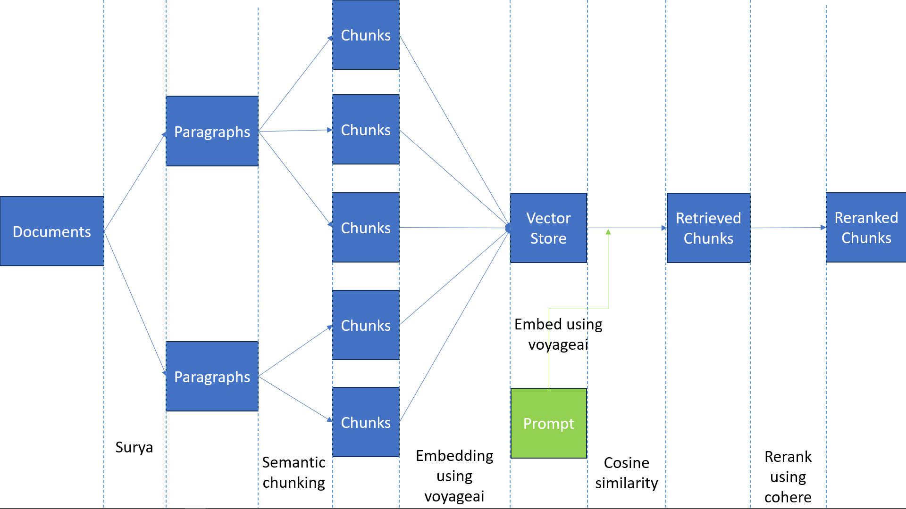
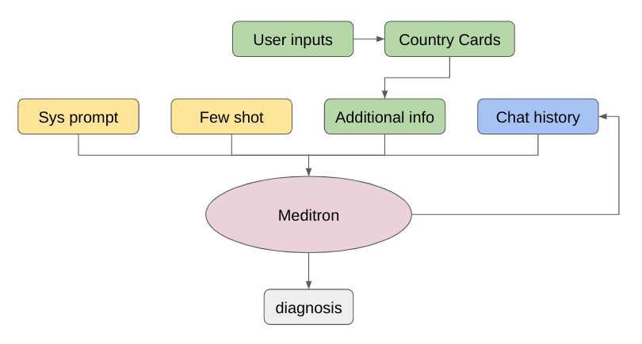
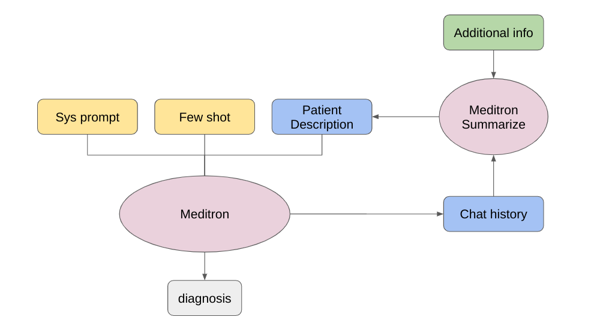

# streamlit_icrc

## Introduction
- This repo presents proofs of concept (POC) of two features that aim to be integrated into the MOOVE platform in the future.
- The RAG feature offers a Retriever Augmented Generation that fetches additional context from a database of medical guidelines to help Meditron-3 give more accurate and relevant answers. It also displays the sources of the retrieved documents to maintain good explainability.
- The Conversational feature offers a version of Meditron-3 tailored for conversational use. The model asks questions mimicking a doctor, to better understand the patient case and give a differential diagnosis.

## Getting Started
- To get started, if you have cloned the repo and want to run this locally, install the dependencies using the following command:

    ```bash
    pip install -r requirements.txt
    ```

    Then run this command:

    ```bash
    streamlit run main.py
    ```

- If you want to access this online from a browser, click on the following link: [Streamlit App](https://healthpoc.streamlit.app/)

## Overall description of RAG

The RAG is fairly simple, we processed the books/guidelines paragraph by paragraph using [Surya](https://github.com/VikParuchuri/surya.git) (you might need a GPU for the surya processing). Then we used semantic chunking to chunk the documents into smaller documents. We use a simple VectorStore to make the search of large corpus of documents fast. The retrieval process is a simple cosine similarity of embeddings into reranking.

Small illustration of how RAG is implemented in this repository:


note:
If you want to use semantic chunking you can use the chunk_text function from documents\data_splitting.py

## Setting up RAG Mode
If you want to use RAG Mode you need to setup a cohere and voyageai account (they are free) and put your API keys in API_token.json

## Modifying base documents for RAG Mode

If you want to embed new documents you can run the embedding.py script with the following command:
    ```
    python3 retriever\embedding.py your_file.jsonl new_embeddings_file.jsonl
    ```
This will create a new embedding file.
You then need to change the files at lines 77 and 80 in main.py to put your embedding and document files

note:
The format of the documents needs to be:
    ```
    {"source_document": , "page_number": , "paragraph_title": , "subtitle": , "text": }
    ```
You should also put the source documents in the 'retriever\ressources' folder if you want the user to be able to check the source document. 


## Overall description of Conversation

The Conversation Chatbot interaction allows users to interact with the Large Language Model more humanly. It is tailored for diagnosis and treatment recommendation, given a patient description. The model will actively ask questions to gather precise information about the patient and suggest diagnostics to pay attention to.
To that extent, the model is system-prompted and hyper-parameters are specifically tuned.

Small illustration of how the architecture for the conversational feature:


### Prompts
You can find the prompts in the ```prompts/conversation``` folder.

### API calls
For calling the model, you can find the corresponding *llm_generate_response* function in the ```conversation_patient_mode.py``` file.
- The first way is using the Meditron-3 medical model, hosted on lambda-labs by EPFL. Disclaimer: Due to recent changes, this model struggles to fit the conversational constraints.
- The second one requires an API key from **LlamaAPI** and uses the Llama-3.1 model, which is not specifically tuned for medical purposes. For security reasons, you should create you own user login and your own API key.

### Country Cards
In order to add relevant context, tailored to each patient description, we add additional information based on user inputs :
- Age of the patient
- Sex of the patient
- Location of the patient)

This information is based on data from the Healthdata website. 
To rebuild and retrieve up to date located in ```scripts/cards```, run the ```scripts/HHME.ipynb``` jupyter notebook.

You need to have an API key at [https://api.healthdata.org/sdg/]([url](https://api.healthdata.org/sdg/)). For now, there is a personal one to make it functional, as it's not linked to any billing but you need to change it and put your own in the ```IHME.ipynb``` file.
When calling the model, it will automatically filter the data and add relevant information based on user entries as additional context.

Small illustration of how the integration of country card information for the conversational feature:

### Additional point

A second way of conversation architecture was developed but /!\ not fully tested /!\ You can find the work under ```conversation_patient_v2.py```, leveraging another agent summarizing the exchanges between the user and the model to extend the length of the conversation. You can find the architecture here:


## General structure information

- In the ```lib/``` folder you can find a skeleton base used in the multiagent architecture.
- In the ```scripts/``` folder you find :
    - ```cards/``` folder that contains data to build the country cards
    - ```location_name_dict.json``` file that is a list of countries and their associated id, that contains data for the country cards
    - scrapers scripts, processing scripts used along the way


